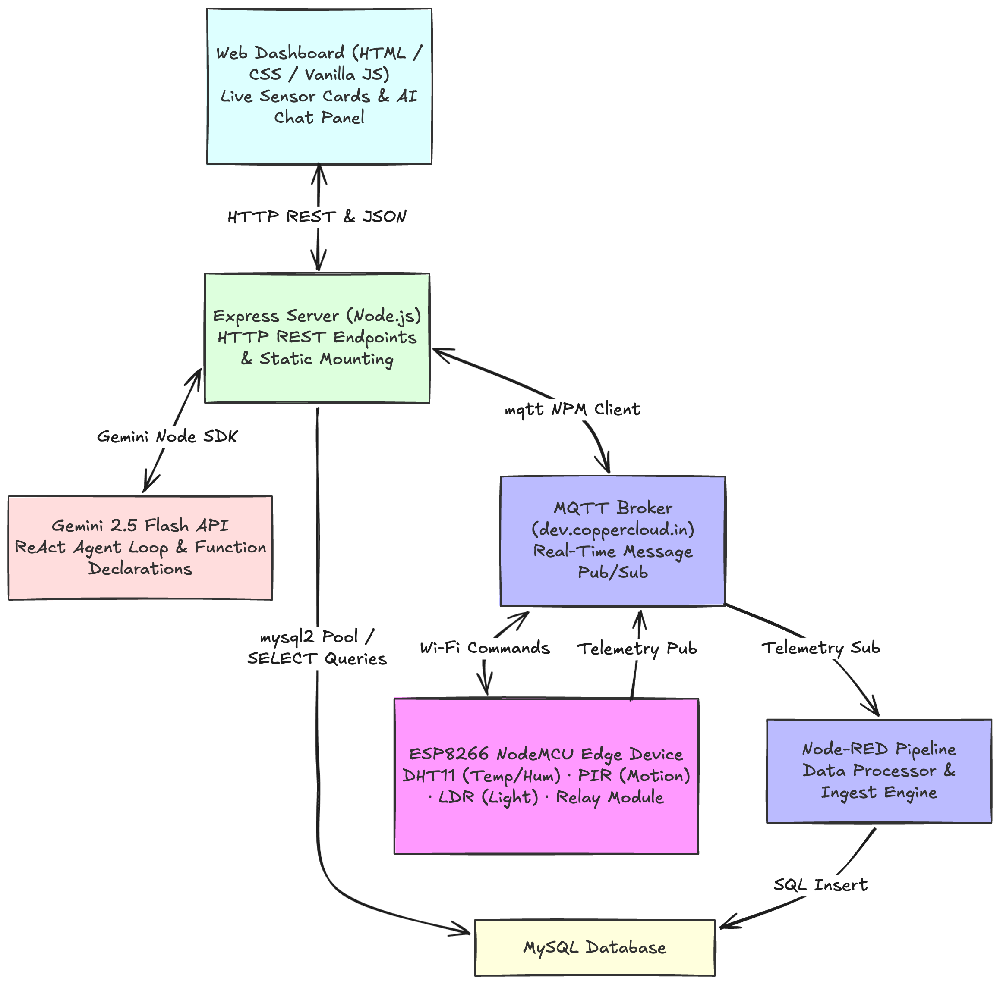

# LumaAgent: MQTT-Driven Edge Sensing System with LLM-Powered IoT Agent

> An end-to-end smart lighting system that combines **real-time IoT sensing** with a **Generative AI operations agent (LumaAgent)** — capable of controlling hardware, querying historical data, and executing dynamic time-based policies through natural language.

---

## What Makes This Different

Most IoT lighting systems use **static rule-based thresholds** — if motion is detected AND light is low, turn ON. Simple. Predictable. Limited.

This project replaces and extends that paradigm with an **LLM-powered agent** that acts as an intelligent operations layer on top of the hardware:

| Capability | Traditional IoT | This System |
|---|---|---|
| Lighting control | Fixed rules only | Natural language + rules + AI reasoning |
| Analytics | Pre-built Grafana charts | Ad-hoc SQL via text-to-query |
| Scheduling | None | *"Turn off in 10 minutes"* → real timer |
| Context awareness | None | Remembers conversation context |
| Occupancy override | Sensor must detect motion | User can declare intent: *"I'm reading for 2 hours"* |

---

## System Architecture


---

## Key Features

### Hardware Layer
- **Motion-based lighting** — PIR sensor triggers relay
- **Ambient light control** — LDR prevents lights turning on in bright rooms
- **Timer-based auto-OFF** — configurable hold time after last motion
- **Dual modes** — AUTO (sensor-driven) and MANUAL (command-driven)

### AI Agent Layer
- **Natural language control** — *"Turn off the light in 10 minutes"*
- **Text-to-SQL analytics** — *"How long was the light on yesterday?"*
- **SQL injection protection** — agent can only run `SELECT` queries
- **ReAct agent loop** — Gemini reasons → calls tool → reasons again → answers
- **Live sensor context** — agent reads real-time MQTT data before answering
- **Dynamic policy engine** — scheduled commands via `setTimeout()`

### Dashboard
- Live sensor cards with flash animations on value change
- One-click relay control (ON / AUTO / OFF)
- AI chat interface with typing indicator and markdown rendering
- Scheduled actions panel

---

## Tech Stack

| Layer | Technology |
|---|---|
| **Edge Device** | ESP8266 NodeMCU (Arduino C++) |
| **Sensors** | DHT11 · PIR · LDR |
| **Messaging** | MQTT (mqtt package · dev.coppercloud.in) |
| **Flow Processing** | Node-RED |
| **Database** | MySQL (`home_automation.sensor_data`) |
| **Visualization** | Grafana |
| **AI Model** | Google Gemini 2.5 Flash (Function Calling) |
| **Backend** | Node.js · Express · nodemon |
| **Frontend** | HTML · Vanilla CSS · Vanilla JS |

---

## Project Structure

```
project-iot/
├── esp8266_code/
│   ├── main.ino              ← ESP8266 firmware (credentials redacted)
│   └── secrets.h.example     ← Credential template (copy → secrets.h)
├── node-red/
│   └── flows.json            ← MQTT → MySQL pipeline
├── database/
│   └── schema.sql            ← sensor_data table definition
├── dashboard/
│   └── grafana.txt           ← Grafana panel reference
├── images/
│   └── ...
├── ai_agent/                 ← AI Agent layer
│   ├── backend/
│   │   ├── .env.example      ← API key / DB credential template
│   │   ├── .gitignore        ← Protects real .env from Git
│   │   ├── package.json      ← Node project dependencies
│   │   ├── config.js         ← Single source of truth for settings
│   │   ├── mqttClient.js     ← MQTT client + live sensor state
│   │   ├── dbClient.js       ← MySQL connection pool + SELECT security
│   │   ├── agent.js          ← Gemini ReAct loop + 4 tool functions
│   │   └── app.js            ← Express server + static file serving
│   └── frontend/
│       ├── index.html
│       ├── style.css
│       └── script.js
└── README.md
```

---

## How to Run

### Prerequisites
- Node.js 18+ & NPM
- MySQL running locally with `home_automation` database
- Node-RED running and pushing data to MySQL
- Gemini API key from [aistudio.google.com](https://aistudio.google.com)

### Step 1 — Arduino Setup
```bash
# In esp8266_code/
cp secrets.h.example secrets.h
# Edit secrets.h with your WiFi credentials
# Flash main.ino to your NodeMCU via Arduino IDE
```

### Step 2 — Backend Setup
```bash
cd ai_agent/backend
cp .env.example .env
# Edit .env with your GEMINI_API_KEY and MySQL password

npm install
npm run dev
```

### Step 3 — Open Dashboard
```
http://localhost:8000
```

That's it. One server. No separate frontend build step.

---

## Agent Capabilities — Example Queries

| User Query | What the Agent Does |
|---|---|
| *"What is the current temperature?"* | Calls `get_current_sensor_status()` → returns live DHT11 reading |
| *"How long was the light on yesterday?"* | Generates `SELECT SUM(...)` → queries MySQL → calculates duration |
| *"Turn off the light in 10 minutes"* | Calls `schedule_relay_action("OFF", 10)` → sets `setTimeout()` timer |
| *"Was anyone home after 10 PM last night?"* | Text-to-SQL on PIR column with time filter |
| *"Switch to AUTO mode"* | Publishes `AUTO` to `home/relay/control` via MQTT |
| *"What's the average humidity this week?"* | Runs `SELECT AVG(HUMIDITY)` with `WHERE TIMESTAMP >= ...` |

---

## Security Design

| Risk | Mitigation |
|---|---|
| API key exposure | Stored in `.env` — listed in `.gitignore`, never committed |
| WiFi credentials in firmware | Moved to `secrets.h` — listed in `.gitignore` |
| LLM prompt injection → SQL write | `dbClient.runReadQuery()` rejects all non-SELECT statements before execution |
| LLM issuing invalid relay commands | `set_relay_mode()` validates against allowed values (`ON`/`OFF`/`AUTO`) |
| CORS attacks from rogue pages | Frontend served by Express at same origin — no external origin allowed |

---

## Future Scope

- [ ] Predictive occupancy modelling (ML on historical PIR data)
- [ ] Multi-room scalability via MQTT topic namespacing
- [ ] Mobile app with push notifications on energy waste alerts
- [ ] Voice interface (Web Speech API → chat endpoint)
- [ ] LLM-generated weekly energy usage reports via email

---

## Dashboard Preview

### Grafana Dashboard


### Node-RED Flow


---

## Author

**Vaibhav (xyron24)**

---

## Conclusion

This project demonstrates a **full-stack IoT + GenAI integration** — from edge sensing on embedded hardware, through real-time MQTT messaging, to a production-grade AI agent with function calling, SQL analytics, and a live web dashboard. Every architectural decision was made to solve a real problem, not to add complexity for its own sake.
